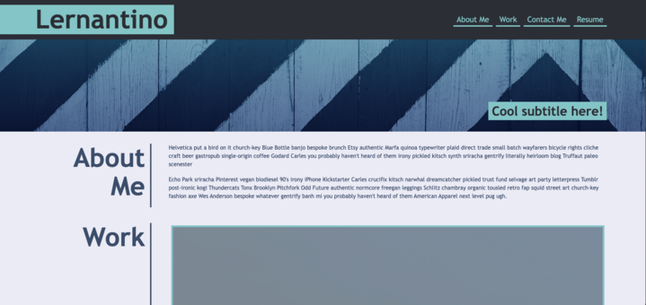
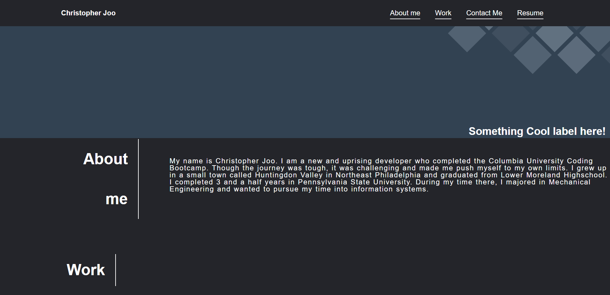
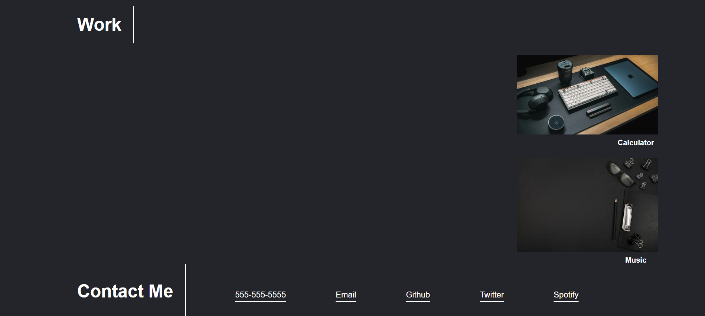

# project-portfoli0

## Description
Motivation behind this project was to have students build a website portfolio from scratch and try to get a better understanding of using different semantics and CSS tools to get the website to fit multiple requirements. From everything we have learned throughout CSS and HTML we were able to build a functioning site.

This project's purpose was to create a portfolio template matching the format of the one provided by the instructors. 

Some of the challenges I faced during this project was trying to build a website from scratch. Though it was very challenging playing around with numbers and pixel counts, I was able to get a better understanding of each command for CSS. When it comes to building websites from scratch, developers have the opportunity and ability to build the HTML from the headings down to the very paragraphs they want to implement that would help make the website come out they want. Something that I found rather challenging was having a design mentality and trying to have my website be visually appealing to the eye. (Matching colors, text that wasnt too big, how to implement proper letter spacing etc). 

Throughout this activity I found out the real challenges behind actually devloping a website. The hardest part about this page was deisgning a proper CSS page.

## Usage
Users will be able to see the project portfolio for Christopher Joo and have links to click on that will allow the user to see the work he has done. 

## Credits 

the instructors and staff from Columbia University Coding Bootcamp